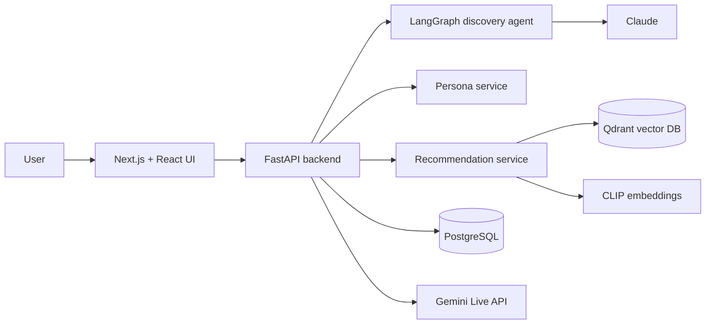

# Echo

<p align="center">
  <strong>An AI product discovery assistant that turns a conversation into live, personalized recommendations.</strong>
</p>

<p align="center">
  <a href="https://nextjs.org"></a>
  <a href="https://react.dev"></a>
  <a href="https://www.python.org"></a>
  <a href="https://fastapi.tiangolo.com"></a>
  <a href="https://qdrant.tech"></a>
  <a href="https://www.typescriptlang.org"></a>
</p>

---

Echo is a full-stack AI shopping prototype built around a simple idea: product search should feel more like talking to a great store associate than filling out filters.

Users describe what they want in natural language. Echo extracts taste signals, keeps a living preference profile, searches a vector catalog, and refreshes recommendations as the conversation evolves. It also supports real-time voice mode for a more natural discovery flow.

## Why this project is interesting

Most recommendation demos stop at “type a query, get similar items.” Echo goes a layer deeper:

- It keeps track of changing preferences across a session.
- It separates the conversation agent from the recommendation service.
- It combines structured persona extraction with vector similarity search.
- It supports both typed chat and live voice interaction.
- It is tested across backend services and frontend UI components.

This repo is meant to show how I design and ship AI product experiences end to end: UX, API contracts, agent orchestration, persistence, testing, and local developer workflow.

## Product highlights

| Area | What Echo does |
| --- | --- |
| Conversational discovery | Guides users through product preferences without forcing them into rigid filters. |
| Persona extraction | Builds a structured profile with likes, dislikes, budget tier, and intent signals. |
| Vector recommendations | Uses CLIP embeddings and Qdrant similarity search to rank products. |
| Feedback loop | Like/dislike actions update the persona and improve future recommendations. |
| Voice mode | Uses Gemini Live API for real-time voice conversation, with text fallback. |
| Full-stack quality | Strict TypeScript, strict mypy, pytest, Vitest, ESLint, Ruff, and GitHub Actions CI. |

## Architecture



**Backend** — Python 3.12, FastAPI, SQLAlchemy, Alembic, PostgreSQL, Qdrant, LangGraph, Claude, CLIP embeddings, Gemini Live API

**Frontend** — Next.js 15 App Router, React 19, TypeScript, Tailwind CSS v4, Vitest, Testing Library

## Code tour

```text
backend/
  app/
    agent/        LangGraph graph, nodes, and state transitions
    routers/      FastAPI endpoints for chat, feedback, recommendations, sessions, voice
    schemas/      Pydantic request/response contracts
    services/     Persona, catalog, recommendation, session, and voice logic
    models/       SQLAlchemy ORM models
    utils/        Embeddings and shared helpers
  alembic/        Database migrations
  tests/          pytest backend coverage

frontend/
  src/
    app/          Next.js routes and layout
    components/   Chat, recommendation, profile, voice, and UI components
    hooks/        Session, chat, persona, recommendation, and voice state
    lib/          API client, SSE helpers, logger, utility functions
    types/        Shared frontend TypeScript models

plans/            Product and technical planning artifacts
```

## Quick start

### Prerequisites

- Python 3.12+
- Node.js 22+
- Docker and Docker Compose
- Anthropic API key
- Gemini API key, if you want to use voice mode

### 1. Start infrastructure

```bash
docker-compose up -d
```

This starts PostgreSQL on port `5432` and Qdrant on port `6333`.

You can also use the Make target:

```bash
make up
```

### 2. Start the backend

```bash
cd backend
cp .env.example .env          # add API keys and local settings
pip install -e ".[dev]"       # or: uv pip install -e ".[dev]"
alembic upgrade head
uvicorn app.main:app --reload --port 8000
```

### 3. Start the frontend

```bash
cd frontend
cp .env.example .env
npm install
npm run dev
```

Open `http://localhost:3000/discover`.

### One-command local dev

```bash
make dev
```

This starts Docker infrastructure, the backend, and the frontend together.

### Containerized app stack

```bash
make container-start
```

This uses the Apple Container CLI to build and start PostgreSQL, Qdrant, the backend image, and the frontend image. Stop it with:

```bash
make container-down
```

## Quality checks

```bash
make lint    # ruff + mypy for backend, eslint for frontend
make test    # pytest for backend, vitest for frontend
```

CI runs backend linting, type checks, and tests, plus frontend linting, type checks, and tests on every push and pull request to `main`.

## Engineering details I cared about

- **Clear service boundaries**: routers stay thin; recommendation, persona, voice, and session logic live in dedicated services.
- **Typed API contracts**: Pydantic schemas on the backend and TypeScript models on the frontend keep payloads explicit.
- **Agent state you can reason about**: LangGraph nodes operate over a structured state object instead of passing loose strings around.
- **Feedback as product signal**: user reactions are first-class inputs to the next recommendation pass.
- **Local-first development**: Docker Compose handles infrastructure, while Make targets keep common workflows short.
- **AI-assisted workflow docs**: Trellis helpers under `.trellis/`, `.claude/`, `.codex/`, and `.agents/` capture project conventions and planning context.

## Environment variables

See:

- `backend/.env.example`
- `frontend/.env.example`

These files document the required local configuration for API keys, backend URLs, database access, and voice mode.

## Status

Echo is a portfolio project and active prototype. The core chat, persona, recommendation, feedback, and voice paths are implemented locally, with planning artifacts included for future product iterations.
